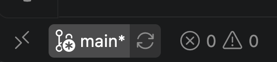
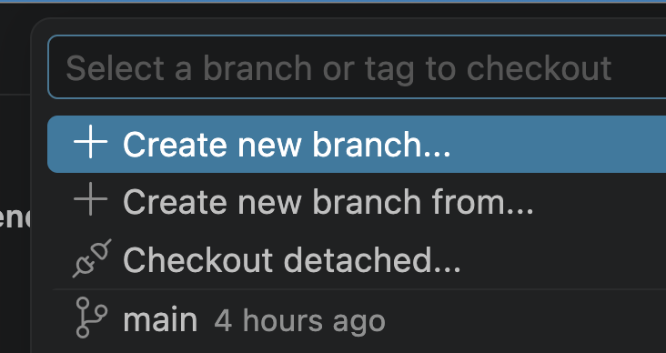
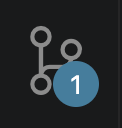

# Werken met Git en GitHub in VS Code: Van Feature Branch tot Merge

Wanneer je in een duo-project samenwerkt aan code, is het slim om een vaste Git-workflow te gebruiken. Zo voorkom je dat je elkaars code per ongeluk overschrijft en zorg je ervoor dat de `main` branch altijd werkende code bevat. Hieronder staat stapsgewijs hoe je dit aanpakt, direct vanuit **VS Code**.

### 1. Een nieuwe Feature Branch maken
Begin nooit direct te programmeren in de `main` branch. Maak voor elke nieuwe taak of functie (feature) een aparte branch aan.

* Zorg dat je op de `main` branch staat. Je ziet de actieve branch altijd **linksonder in de statusbalk** van VS Code.
 
 

 
 

* Klik op de branchnaam linksonder, of open het Command Palette (`Ctrl+Shift+P` of `Cmd+Shift+P`) en typ: **Git: Create Branch**.
 
 

 
 
* Geef je branch een duidelijke naam, bijvoorbeeld `feature-inlogscherm` of `feature-footer`.

### 2. Wijzigingen committen en pushen naar GitHub
Heb je een deel van de code geschreven en getest? Dan sla je dit op in Git.

* Klik in de linkerbalk van VS Code op het **Source Control (Git) icoontje** (de drie bolletjes met lijntjes).
 

 
* Klik op het **+**-icoontje naast je gewijzigde bestanden om ze klaar te zetten (*stage*).
* Typ een duidelijke boodschap in het commit-veld (bijv. *"Inlogformulier lay-out toegevoegd"*) en klik op **Commit**.
* Omdat dit een nieuwe branch is, verschijnt er direct een grote blauwe knop genaamd **Publish Branch**. Klik hierop om je branch naar GitHub te sturen.

### 3. Een Pull Request (PR) aanmaken en assignen
Zodra je feature af is, wil je deze samenvoegen met de `main` branch. Dit doe je via een Pull Request op GitHub.

* Ga naar de GitHub-pagina van jullie project. Je ziet vaak direct een gele balk met de knop **Compare & pull request**. Klik hierop.
* Geef je PR een korte titel en beschrijf kort wat je hebt gemaakt.
* **Assignen aan je buddy:** Klik aan de rechterkant bij *Reviewers* of *Assignees* en selecteer je teamgenoot. Omdat jullie in duo's werken, is je buddy de persoon die jouw code moet controleren.

### 4. Testen, keuren en mergen
Het is nu aan je teamgenoot om de code te controleren. 
* Je buddy bekijkt de wijzigingen op GitHub (onder het tabblad *Files changed*), downloadt de branch eventueel lokaal om te testen of alles werkt en laat een review achter.
* Is de code goedgekeurd en werkt alles vlekkeloos? Klik dan op GitHub op de grote groene knop: **Merge pull request** en daarna op **Confirm merge**. De code staat nu veilig in de `main` branch!

### 5. Je lokale `main` branch updaten
Nu de code op GitHub is samengevoegd, loopt jouw lokale computer achter. Je moet je eigen `main` branch verversen.

* Schakel in VS Code via de linkeronderhoek weer om naar de **main** branch.
* Klik op het synchronisatie-icoontje (het rondje met pijltjes naast de branchnaam) of gebruik de knop **Pull** om de nieuwste code van GitHub op te halen. Je lokale `main` is nu weer helemaal bij de tijd.

### 6. Een langer lopende feature branch updaten met `main`
Werk je aan een grote opdracht in een branch die al een paar dagen openstaat? Ondertussen heeft je buddy misschien al andere PR's gemerged naar `main`. Om te zorgen dat jouw branch geen achterstand oploopt (en je merge-conflicten voorkomt), moet je tussentijds de nieuwste `main` naar jouw branch halen.

* Schakel in VS Code over naar jouw langer lopende feature branch.
* Open het Command Palette (`Ctrl+Shift+P` of `Cmd+Shift+P`) en typ: **Git: Merge Branch...**.
* Selecteer **main** uit de lijst. 
* Git voegt nu de nieuwste wijzigingen van de `main` branch toe aan jouw huidige feature branch. Eventuele conflicten kun je nu direct in VS Code oplossen, zodat je daarna weer veilig verder kunt programmeren!
