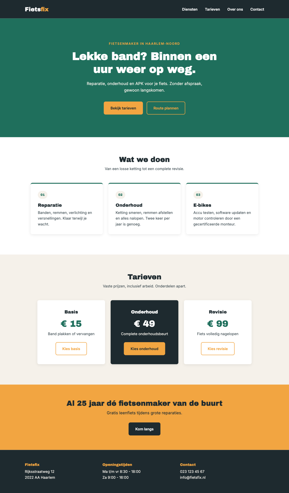

## Hoofdstuk 8b: Namaakopdracht - Fietsfix

*Docentenhandleiding: `Docent/Hoofdstuk 8b - Docentenhandleiding.md`*

**Extra opdracht bij het eindproject** - alle technieken uit Hoofdstuk 1 t/m 8
**PRIMM-fase:** Make (naar een ontwerp)

### Waarom deze opdracht?
In het echte werk krijg je bijna nooit de opdracht "maak maar iets moois". Een designer levert een **ontwerp** aan en jij bouwt het na, zo precies mogelijk. Dat is een andere vaardigheid dan zelf ontwerpen: je moet goed kijken, maten en kleuren overnemen en bedenken welke CSS erachter zit.

Fietsenmaker **Fietsfix** heeft een ontwerp laten maken. Jij bouwt het.

### Leerdoelen
Na deze opdracht kan je:
- Een ontwerp (mockup) analyseren: welke secties, welke elementen, welke herhaling?
- Kleuren, lettertypes en spacing uit een stijlgids overnemen in CSS-variabelen
- Een ontwerp omzetten naar semantische HTML
- Je eigen resultaat vergelijken met het ontwerp en de verschillen verklaren

### AI-gebruik
**Stap 1 en 2: AI uit.** Het analyseren van het ontwerp doe je zelf. **Stap 3 en verder: AI mag**, maar je moet elke regel kunnen uitleggen. Een screenshot van het ontwerp in AI plakken en de code overnemen telt níet als jouw werk.

---

### Het ontwerp

*Ontworpen op een schermbreedte van 1280px.*

---

### Stijlgids

De designer heeft er een stijlgids bij geleverd. Gebruik **precies** deze waarden.

**Kleuren**

| Naam | Hex | Gebruikt voor |
|---|---|---|
| Primair (groen) | `#1f6f5c` | Hero-achtergrond, prijzen, rand bovenop de cards |
| Accent (oranje) | `#f2a541` | Knoppen, logo "fix", label boven de titel, CTA-sectie |
| Donker | `#1e2a2f` | Header, footer, koppen, uitgelicht tarief |
| Licht (beige) | `#f5f1ea` | Achtergrond tarieven-sectie, nummerbolletjes |
| Tekst | `#3c4a50` | Gewone tekst |

**Lettertypes** (Google Fonts)

| Waar | Font | Grootte |
|---|---|---|
| `h1` | Archivo Black | 48px |
| `h2` | Archivo Black | 32px |
| `h3` | Archivo Black | 20px |
| Logo | Archivo Black | 26px |
| Prijs | Archivo Black | 40px |
| Gewone tekst | Inter (400 en 600) | 16px, `line-height: 1.6` |
| Label boven de titel | Inter 600, hoofdletters | 14px, `letter-spacing: 2px` |

**Spacing en vormen**

| Element | Waarde |
|---|---|
| Container | max. 1100px breed, gecentreerd |
| Hero | 100px padding boven en onder |
| Secties | 80px padding boven en onder |
| Cards | 320px breed, 32px padding, rand bovenop 4px |
| Tarieven | 300px breed, 40px / 32px padding |
| Knoppen | 14px / 28px padding, rand 2px |
| Afgeronde hoeken | 8px |
| Schaduw | `0 4px 12px rgba(0, 0, 0, 0.08)` |

**Hover/focus**
- Navigatielinks: worden oranje en krijgen een oranje streep eronder
- Primaire knop (oranje): wordt wit
- Secundaire knop (oranje rand): vult zich oranje

---

### Stap 1: Analyseer het ontwerp (15 min, op papier, AI uit)

Bouw nog niets. Pak papier en beantwoord:
1. Uit welke **secties** bestaat de pagina? Schrijf ze van boven naar beneden op en zet erbij welk HTML-element je gebruikt (`<header>`, `<section>`, `<footer>`, ...)
2. Welke elementen komen **meerdere keren** voor met dezelfde opmaak? Die krijgen een gedeelde class
3. Hoeveel **knop-varianten** zie je? Welke eigenschappen delen ze, en wat is anders?
4. Het tarief in het midden ziet er anders uit dan de andere twee. Hoe los je dat op **zonder** alle CSS te kopiëren?
5. Welke secties hebben een **gekleurde achtergrond** over de volle breedte, terwijl de inhoud netjes in het midden staat? Hoe heet de techniek uit Hoofdstuk 7 daarvoor?

Laat je antwoorden aftekenen door je docent voordat je verder gaat.

### Stap 2: HTML-structuur (20 min, AI uit)

1. Maak een nieuwe map `fietsfix` met `index.html` en `css/style.css`
2. Schrijf **alleen de HTML**, nog geen CSS. Alle teksten staan in het ontwerp
3. Controleer: zonder CSS moet de pagina van boven naar beneden logisch te lezen zijn

### Stap 3: Variabelen en basis (15 min)

1. Laad de twee Google Fonts
2. Zet alle kleuren uit de stijlgids in `:root` als variabelen
3. Reset (`* { margin: 0; padding: 0; box-sizing: border-box; }`), `body`, koppen en `.container`

### Stap 4: Sectie voor sectie bouwen

Werk van boven naar beneden. Na elke sectie: **vergelijk met het ontwerp** (zet ze naast elkaar op je scherm).

1. Header met logo en navigatie
2. Hero met label, titel, intro en twee knoppen
3. "Wat we doen" met drie cards
4. Tarieven met drie blokken, het middelste uitgelicht
5. Call-to-action (oranje)
6. Footer met drie kolommen

> **Tip:** Zet je browservenster op 1280px breed (DevTools → apparaatmodus → "Responsive", breedte 1280). Dan kun je het beste vergelijken.

### Stap 5: Vergelijken (10 min)

Maak een screenshot van jouw pagina en leg hem naast het ontwerp. Noteer **drie verschillen** en los ze op. Kun je een verschil niet oplossen? Schrijf dan op waarom niet.

---

### Eisen

- [ ] Pagina lijkt zichtbaar op het ontwerp: zelfde secties, volgorde, kleuren en lettertypes
- [ ] Alle kleuren via CSS-variabelen, geen losse hex-codes buiten `:root`
- [ ] Semantische HTML: `<header>`, `<nav>`, `<main>`, `<section>`, `<article>`, `<footer>`
- [ ] Geen inline `style="..."`
- [ ] Knoppen: één basis-class + varianten, met hover én focus
- [ ] Uitgelicht tarief via een extra class, niet via gekopieerde CSS
- [ ] Inhoud begrensd met `.container`
- [ ] De navigatielinks springen naar de juiste sectie

### Bonus
- [ ] De hover-states werken precies zoals in de stijlgids
- [ ] Je hebt het "vergelijk"-verslag (stap 5) met drie opgeloste verschillen
- [ ] Na Hoofdstuk 9/10: bouw de cards en tarieven om naar Flexbox en maak de pagina responsive
